# ACE E-commerce Platform Workflows

## 1. User Journey Workflows

### 1.1 Unregistered User Flow

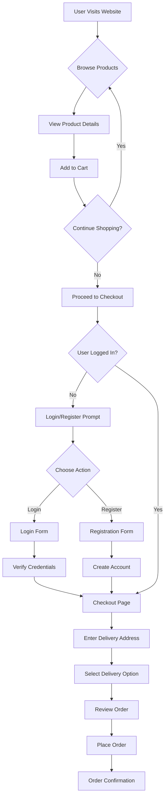

### 1.2 Registered User Flow

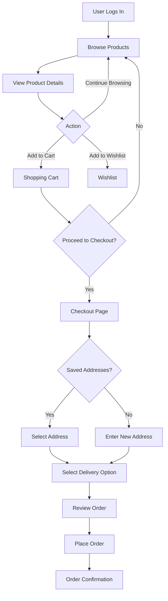

## 2. Inventory & Dealer Workflow

### 2.1 Order Routing & Approval Flow

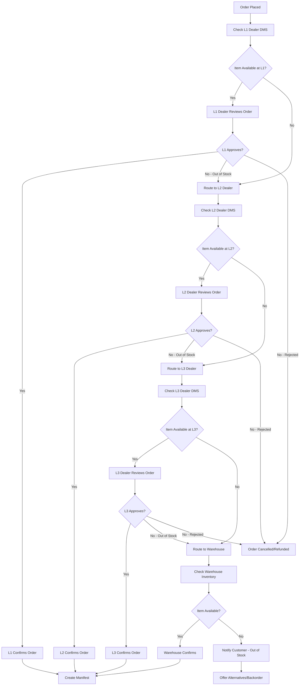

### 2.2 Multi-Item Order Routing

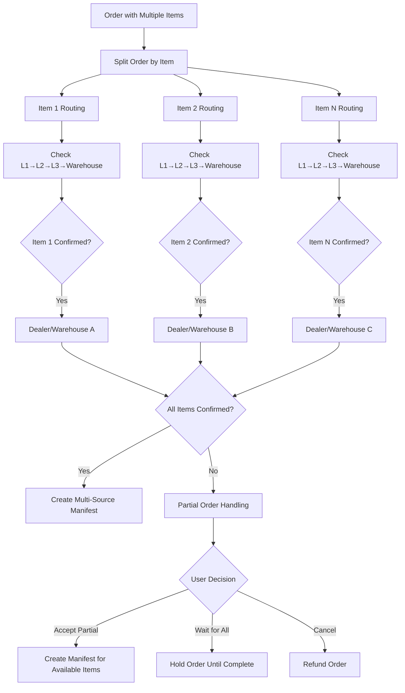

## 3. Delivery Workflow

### 3.1 Delivery Partner Selection

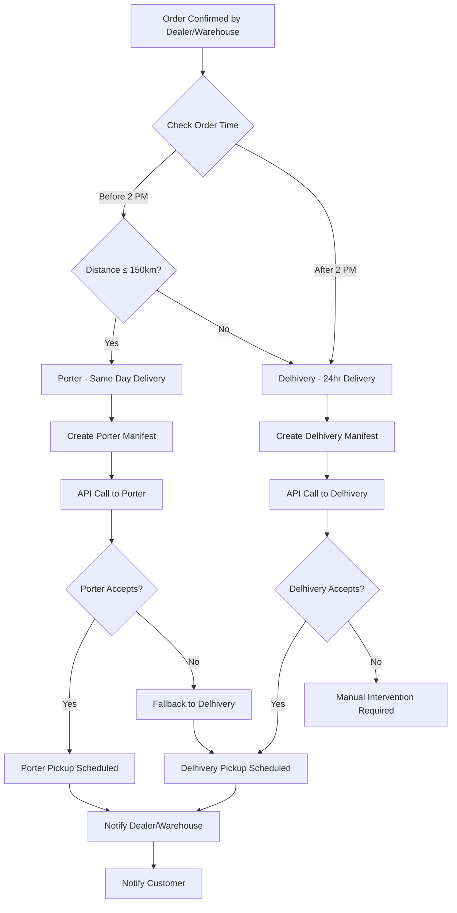

### 3.2 Manifest Creation & Pickup

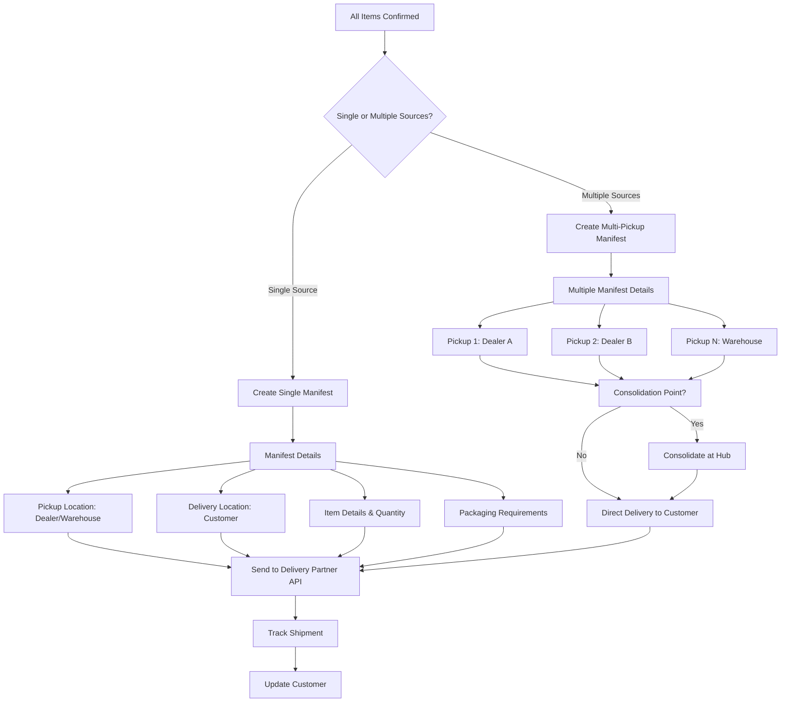

## 4. Payment Workflow

### 4.1 Payment Processing

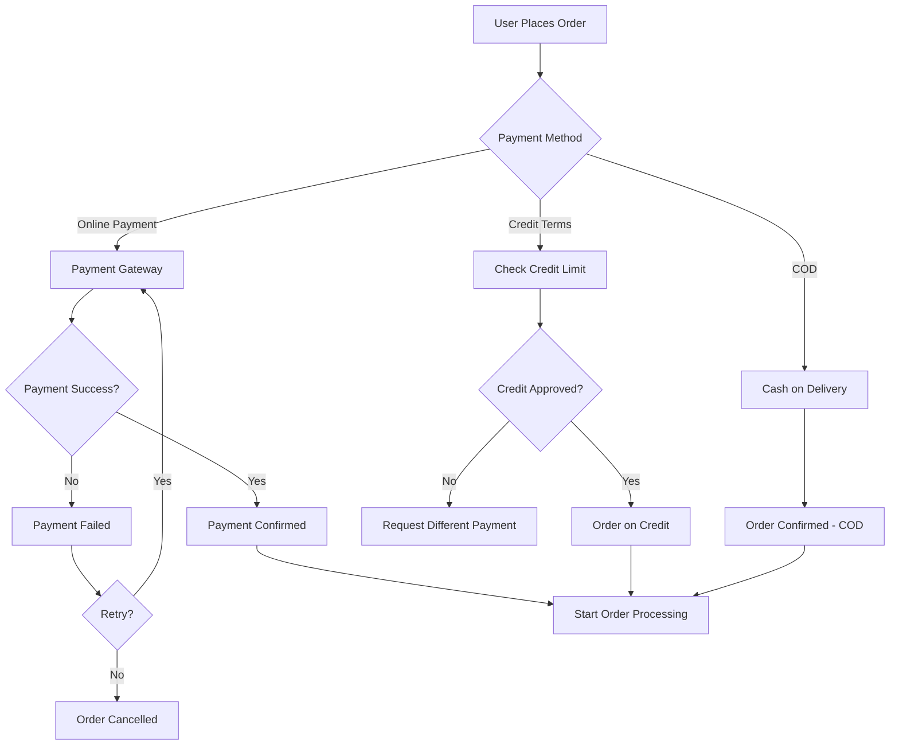

## 5. Dealer Dashboard Workflow

### 5.1 Dealer Order Management

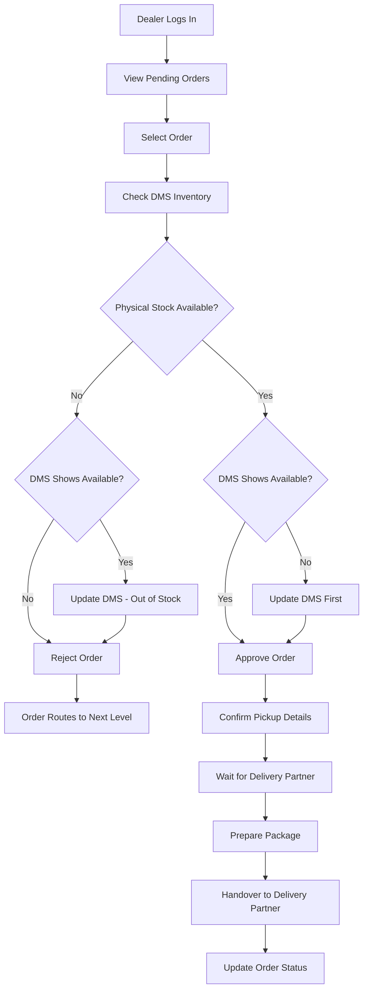

## 6. Edge Case Workflows

### 6.1 DMS Inventory Mismatch

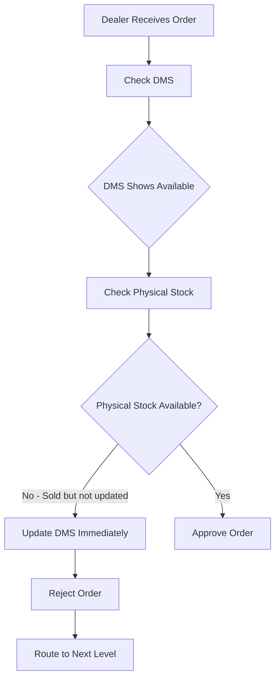

### 6.2 Partial Availability

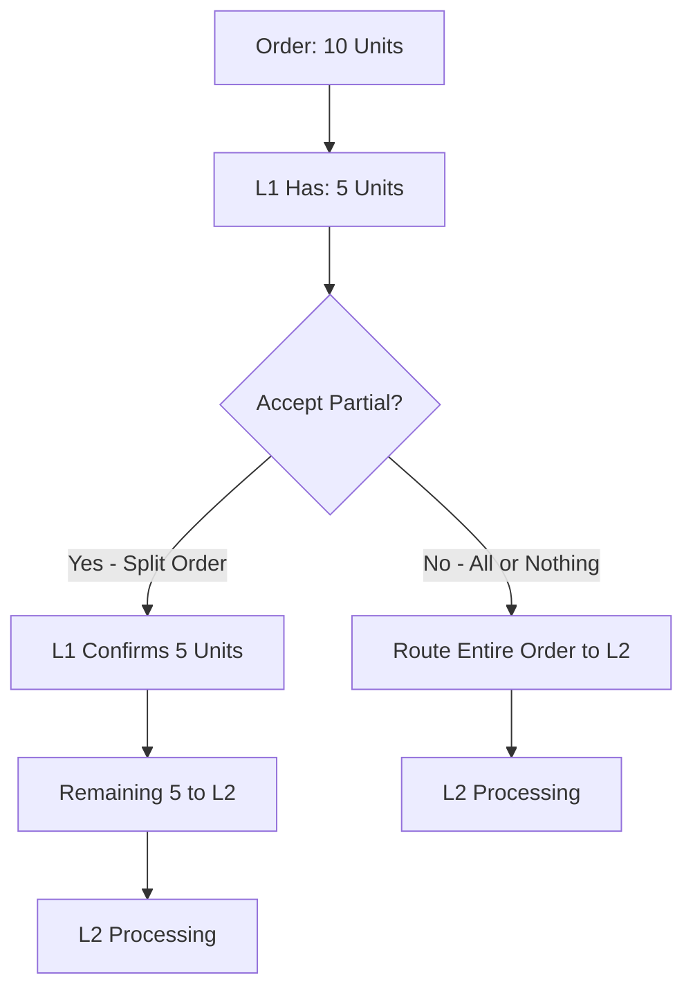

### 6.3 All Dealers Reject

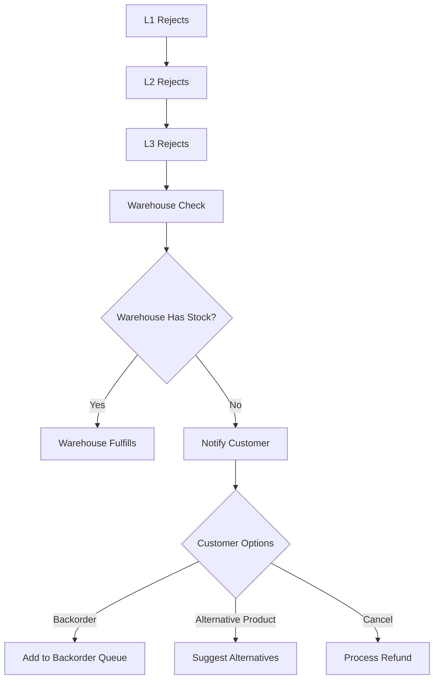

### 6.4 Delivery Partner Unavailable

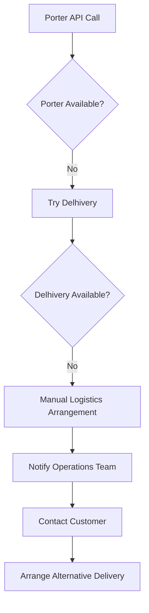

## 7. Return & Refund Workflow

### 7.1 Return Process

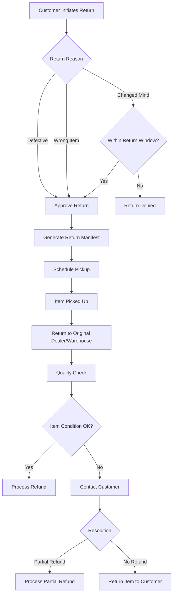

## Workflow Summary

This document covers:
1. **User Journeys**: Registered and unregistered user flows
2. **Inventory Management**: L1→L2→L3→Warehouse routing
3. **Dealer Workflows**: Order approval and fulfillment
4. **Delivery Integration**: Porter and Delhivery selection logic
5. **Manifest Creation**: Single and multi-source pickups
6. **Edge Cases**: DMS mismatches, partial availability, rejections
7. **Payment Processing**: Multiple payment methods
8. **Returns**: Complete return and refund process
