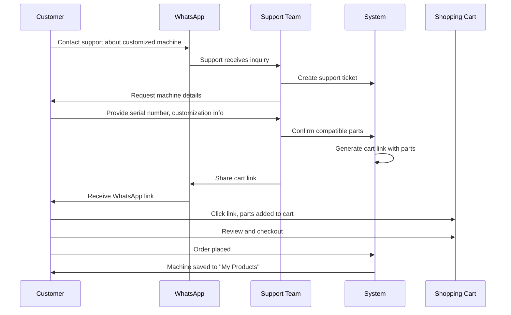

# ACE E-commerce - Customized Machine Features

## Overview

Enhanced the ACE e-commerce platform with comprehensive support for customized machines, customer support workflow, and intelligent part suggestions.

---

## Case 1: Customized Machine Support Workflow

### Customer Journey



### Implementation Details

#### 1. Customer Contacts Support
- Customer calls or messages on WhatsApp about customized machine
- Provides machine details: model, serial number, customizations

#### 2. Support Team Workflow
```typescript
// Create support ticket
POST /api/support/tickets
{
  "type": "PART_INQUIRY",
  "subject": "Parts for customized FX14 crane",
  "description": "Customer has FX14 with extended boom customization",
  "customerMachineId": "machine-123",
  "whatsappNumber": "+91-9876543210"
}
```

#### 3. Part Confirmation
```typescript
// Support confirms parts
POST /api/support/tickets/{ticketId}/confirm-parts
{
  "parts": [
    { "productId": "part-001", "quantity": 2, "notes": "Extended boom hydraulic cylinder" },
    { "productId": "part-002", "quantity": 1, "notes": "Boom extension kit" }
  ]
}

// Response includes cart link
{
  "cartLink": "/cart/add-from-support?token=SUPP-ABC123",
  "ticket": { ... }
}
```

#### 4. Customer Adds Parts via Link
- Support shares link via WhatsApp
- Customer clicks link
- Parts automatically added to cart
- Customer can review and checkout

#### 5. Machine Saved to History
```typescript
// After order, machine is registered
POST /api/machines
{
  "machineId": "ace-fx14-2024",
  "serialNumber": "FX14-2024-001",
  "nickname": "Main Crane",
  "purchaseDate": "2024-01-15"
}

// Machine appears in "My Products"
GET /api/machines
// Returns all customer's machines with customizations
```

---

## Case 2: Comprehensive Repository

### Repository Structure

```
MachineRepository
├── Machines (All ACE machines)
│   ├── Standard Machines
│   └── Customizable Machines
├── Customers
│   ├── Machine Ownership History
│   └── Customization Details
├── Parts
│   ├── Standard Parts
│   └── Custom Parts
└── Customizations
    ├── Structural
    ├── Hydraulic
    └── Electrical
```

### Database Models

#### Machine
```prisma
model Machine {
  machineNumber     String   @unique  // "ACE-FX14-2024"
  name              String             // "FX 14 Mobile Crane"
  category          String             // "Mobile Cranes"
  isCustomizable    Boolean
  compatibleParts   PartCompatibility[]
  customizations    MachineCustomization[]
}
```

#### CustomerMachine
```prisma
model CustomerMachine {
  userId            String
  machineId         String
  serialNumber      String?
  hasCustomization  Boolean
  customizations    CustomerMachineCustomization[]
}
```

#### PartCompatibility
```prisma
model PartCompatibility {
  productId         String
  machineId         String
  isStandardPart    Boolean
  isCustomPart      Boolean
  customizationIds  String[]  // Which customizations need this part
  priority          Int       // Importance ranking
}
```

### Repository Sync

```typescript
// Update repository statistics
import { updateMachineRepository } from '@/lib/services/machineService'

const repo = await updateMachineRepository()
// {
//   totalMachines: 150,
//   totalCustomers: 5000,
//   totalParts: 12000,
//   totalCustomizations: 45,
//   lastSyncedAt: "2024-12-11T10:00:00Z"
// }
```

---

## Smart Part Suggestions

### Suggestion Types

#### 1. Compatible Parts
```typescript
// Parts compatible with customer's machine
{
  suggestionType: "COMPATIBLE_PART",
  reason: "Compatible with your FX 14 Mobile Crane",
  relevanceScore: 85
}
```

#### 2. Customization Required
```typescript
// Parts needed for machine customizations
{
  suggestionType: "CUSTOMIZATION_REQUIRED",
  reason: "Required for your extended boom customization",
  relevanceScore: 95
}
```

#### 3. Similar Machine Users
```typescript
// What other FX14 owners buy
{
  suggestionType: "SIMILAR_MACHINE_USERS",
  reason: "Popular among FX 14 Mobile Crane owners",
  relevanceScore: 75
}
```

#### 4. Frequently Bought Together
```typescript
// Parts often bought with selected part
{
  suggestionType: "FREQUENTLY_BOUGHT",
  reason: "Customers who bought this also bought...",
  relevanceScore: 70
}
```

### API Usage

```typescript
// Get personalized suggestions
GET /api/suggestions?limit=10

// Response
{
  "suggestions": [
    {
      "product": { ... },
      "suggestionType": "COMPATIBLE_PART",
      "reason": "Compatible with your FX 14 Mobile Crane",
      "relevanceScore": 85
    }
  ]
}
```

---

## Key Features

### 1. Machine History ("My Products")
- All customer machines in one place
- Serial numbers and purchase dates
- Customization details
- Quick access to compatible parts

### 2. Part Compatibility Engine
- Automatic filtering based on machine model
- Custom part suggestions for customized machines
- Priority-based recommendations

### 3. Support Ticket System
- WhatsApp integration
- Part inquiry tracking
- Cart link generation
- Ticket resolution workflow

### 4. Intelligent Suggestions
- ML-like recommendation engine
- Based on:
  - Machine compatibility
  - Customizations
  - Similar user behavior
  - Purchase history
  - Frequently bought together

---

## API Endpoints

### Machine Management
- `GET /api/machines` - Get customer's machines
- `POST /api/machines` - Register new machine
- `GET /api/machines/{id}/compatible-parts` - Get compatible parts

### Support
- `GET /api/support/tickets` - Get customer's tickets
- `POST /api/support/tickets` - Create support ticket
- `POST /api/support/tickets/{id}/confirm-parts` - Confirm parts (Admin)

### Suggestions
- `GET /api/suggestions` - Get personalized suggestions

---

## Example Workflows

### Workflow 1: New Customer with Customized Machine

1. **Customer contacts support**
   - "I have FX14 crane with extended boom, need parts"

2. **Support creates ticket**
   ```typescript
   POST /api/support/tickets
   {
     "type": "PART_INQUIRY",
     "subject": "Parts for FX14 with extended boom",
     "description": "Customer needs hydraulic parts",
     "whatsappNumber": "+91-9876543210"
   }
   ```

3. **Support confirms parts**
   ```typescript
   POST /api/support/tickets/{id}/confirm-parts
   {
     "parts": [
       { "productId": "hyd-cyl-001", "quantity": 2 },
       { "productId": "boom-ext-kit", "quantity": 1 }
     ]
   }
   ```

4. **Customer receives WhatsApp link**
   - Clicks link
   - Parts added to cart
   - Completes checkout

5. **Machine auto-registered**
   - After order, machine saved to "My Products"
   - Future suggestions based on this machine

### Workflow 2: Returning Customer

1. **Customer logs in**
   - Sees "My Products" section
   - Views their FX14 crane

2. **Views compatible parts**
   ```typescript
   GET /api/machines/{machineId}/compatible-parts
   ```

3. **Receives suggestions**
   - "Based on your FX14 with extended boom..."
   - Shows custom parts for extended boom
   - Shows what similar FX14 owners buy

4. **Direct purchase**
   - No need for support
   - Parts already filtered for their machine

---

## Benefits

### For Customers
✅ Personalized part recommendations  
✅ Easy support via WhatsApp  
✅ Machine history tracking  
✅ No confusion about compatibility  
✅ Faster reordering  

### For Support Team
✅ Streamlined ticket management  
✅ Easy part confirmation  
✅ WhatsApp integration  
✅ Reduced back-and-forth  

### For Business
✅ Comprehensive data repository  
✅ Better inventory planning  
✅ Customer behavior insights  
✅ Increased repeat purchases  
✅ Reduced support time  

---

## Database Schema Additions

### New Models (8)
1. `Machine` - All ACE machines
2. `CustomerMachine` - Customer ownership
3. `MachineCustomization` - Available customizations
4. `CustomerMachineCustomization` - Customer's customizations
5. `PartCompatibility` - Part-machine relationships
6. `SupportTicket` - Support tickets
7. `SupportMessage` - Ticket messages
8. `PartSuggestion` - Smart suggestions
9. `MachineRepository` - Analytics repository

### Enhanced Models
- `User` - Added `machines` and `supportTickets` relations
- `Product` - Added `isCustomPart`, `customizationRequired`, `compatibility`

---

## Next Steps

1. **WhatsApp Integration**
   - Integrate WhatsApp Business API
   - Automated message sending
   - Two-way communication

2. **Machine Recognition**
   - QR code on machines
   - Scan to register
   - Auto-populate details

3. **Predictive Maintenance**
   - Suggest parts based on usage
   - Maintenance schedules
   - Wear-and-tear predictions

4. **Mobile App**
   - Quick part lookup
   - Scan machine serial number
   - Instant support access
